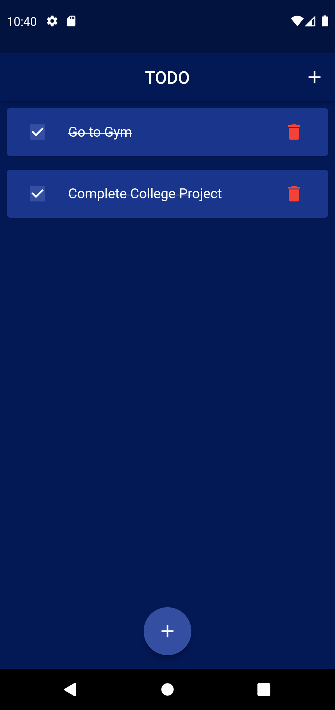
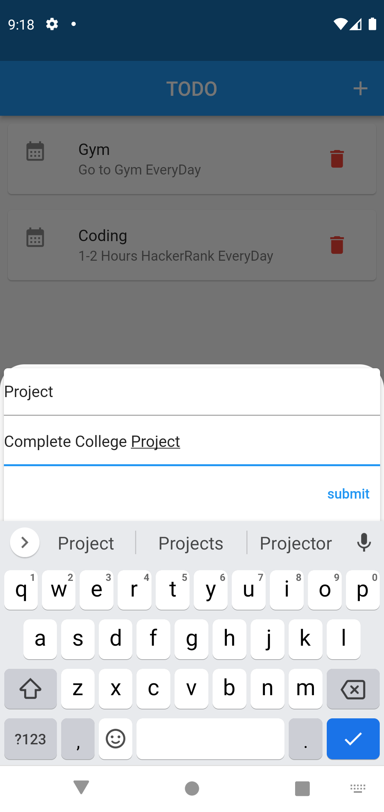
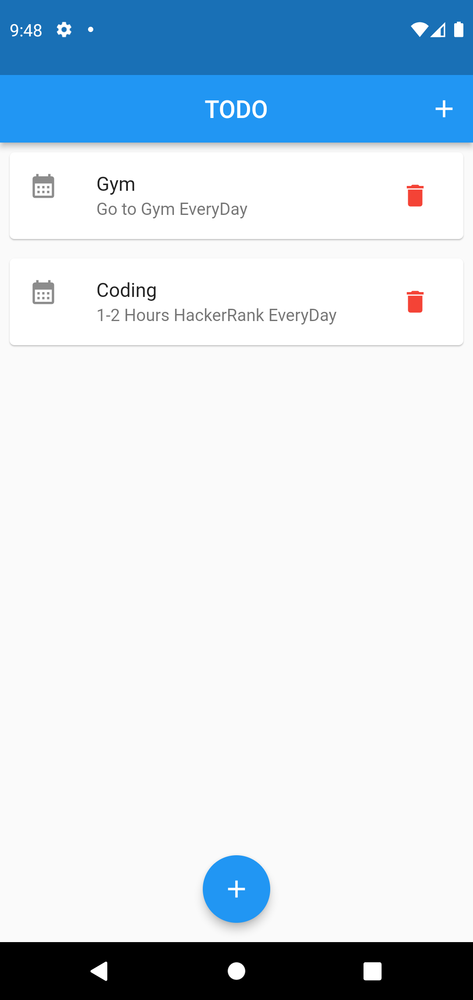
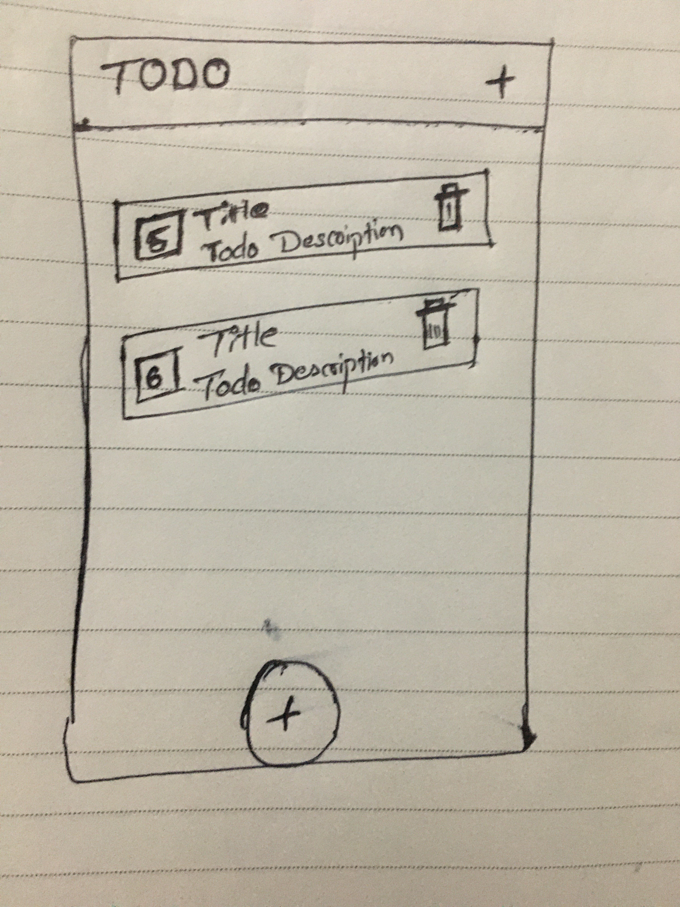
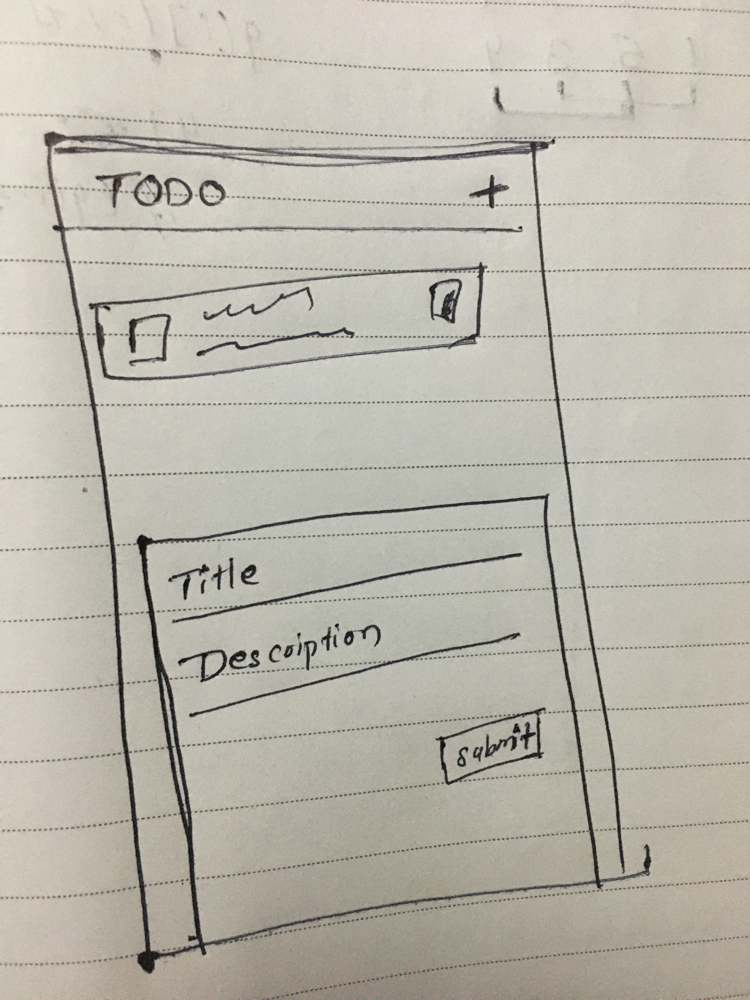

<h1>TODO App</h1>
<h3>Day-3 Final UI and Added Local Storage</h3>
<h5><i>Final App</i></h5>

<h3>Day-2 User Can Add Data</h3>
<h5><i>Modal Bottom Sheet</i></h5>

<h3>Day-1 UI Design Completed</h3>
<h5><i>Home Page</i></h5>

<h3>Sample Design</h3>  
<h5><i>Home Page</i></h5>

<h5><i>Add Screen</i></h5>
